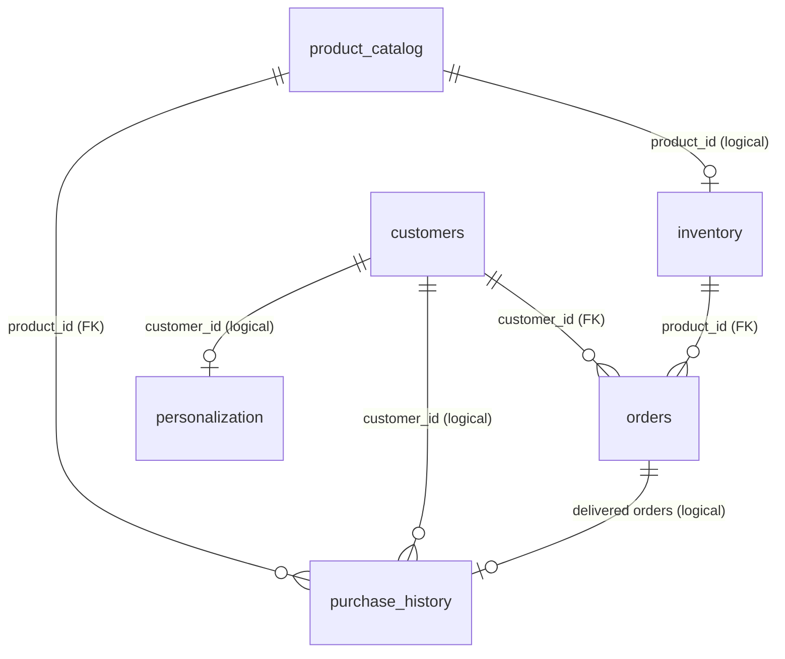

# Database Schema Overview

One Neon Postgres database (`neondb`), **one schema per agent**. Created and seeded by `scripts/neon-db-creation/init_neon.py`.

| Schema | Agent | Tables |
|---|---|---|
| `order_management` | Order management | `customers`, `inventory`, `orders` |
| `product_recommendation` | Product recommendation | `product_catalog`, `purchase_history` |
| `personalization` | Personalization | `personalization` |

Shared IDs: customers `cust001`..`cust005`, products `prod001`..`prod008`.

---

## `order_management`

### `customers`: who the customer is
| Column | Type | Notes |
|---|---|---|
| `customer_id` | VARCHAR(50) | **PK** |
| `first_name`, `last_name` | VARCHAR(100) | required |
| `email` | VARCHAR(255) | required, unique |
| `phone`, `address`, `city`, `state`, `zip_code` | text | contact / shipping details |
| `created_date` | DATE | required, signup date |
| `created_at`, `updated_at` | TIMESTAMP | audit, default now |

### `inventory`: stock per product
| Column | Type | Notes |
|---|---|---|
| `product_id` | VARCHAR(50) | **PK** |
| `product_name`, `category` | text | required |
| `quantity` | INTEGER | `>= 0` |
| `in_stock` | BOOLEAN | must equal `quantity > 0` (CHECK) |
| `reorder_threshold` | INTEGER | default 10 |
| `reorder_quantity` | INTEGER | default 50 |
| `last_restock_date` | DATE | |
| `price_per_unit` | DECIMAL(10,2) | `>= 0` |
| `created_at`, `updated_at` | TIMESTAMP | audit |

### `orders`: one product per order
| Column | Type | Notes |
|---|---|---|
| `order_id` | VARCHAR(50) | **PK** (e.g. `ORD-1001`) |
| `customer_id` | VARCHAR(50) | **FK** → `customers.customer_id` |
| `product_id` | VARCHAR(50) | **FK** → `inventory.product_id` |
| `product_name` | VARCHAR(255) | denormalized copy |
| `order_status` | VARCHAR(50) | `processing` / `shipped` / `delivered` / `cancelled` |
| `shipping_status` | VARCHAR(50) | `preparing` / `in_transit` / `delivered` / `cancelled` |
| `return_exchange_status` | VARCHAR(50) | `return_requested` / `exchange_completed`; only when order is `delivered` |
| `order_date` | DATE | required |
| `delivery_date` | DATE | must be NULL when cancelled |
| `quantity` | INTEGER | `> 0`, default 1 |
| `price_per_unit` | DECIMAL(10,2) | required, `>= 0` |
| `total_amount` | DECIMAL(10,2) | must equal `quantity * price_per_unit` |
| `created_at`, `updated_at` | TIMESTAMP | audit |

Indexes: `orders(customer_id)`, `orders(order_status)`, `orders(order_date)`, `inventory(category)`, `inventory(in_stock)`.

---

## `product_recommendation`

### `product_catalog`: product master data
| Column | Type | Notes |
|---|---|---|
| `product_id` | TEXT | **PK** |
| `product_name`, `category` | TEXT | required |
| `price` | DOUBLE PRECISION | `>= 0` |
| `description` | TEXT | |
| `rating` | DOUBLE PRECISION | default 0.0 |
| `popularity` | TEXT | default `medium`; seed uses `high` / `medium` (not enforced by a CHECK) |

### `purchase_history`: what each customer bought
| Column | Type | Notes |
|---|---|---|
| `id` | SERIAL | **PK** |
| `customer_id` | TEXT | required (no FK, see below) |
| `product_id` | TEXT | **FK** → `product_catalog.product_id` |
| `purchase_date` | DATE | required |
| `quantity` | INTEGER | `> 0`, default 1 |
| `purchase_amount` | DOUBLE PRECISION | required |
| `payment_method` | TEXT | default `credit_card` |

---

## `personalization`

### `personalization`: customer profile and preferences (one row per customer)
| Column | Type | Notes |
|---|---|---|
| `customer_id` | TEXT | **PK** (no FK, see below) |
| `age`, `gender`, `income`, `location`, `marital_status` | INTEGER / TEXT | demographics (`income` is a range string) |
| `preferred_category`, `price_range`, `preferred_brand` | TEXT | shopping preferences |
| `loyalty_tier` | TEXT | seed uses `bronze` / `silver` / `gold` / `platinum` (not enforced by a CHECK) |

---

## How everything connects

Tables in `order_management`: `customers`, `inventory`, `orders`. In `product_recommendation`: `product_catalog`, `purchase_history`. In `personalization`: `personalization`.

### Enforced links (foreign keys, inside one schema only)
- `orders.customer_id` → `customers.customer_id`
- `orders.product_id` → `inventory.product_id`
- `purchase_history.product_id` → `product_catalog.product_id`

### Logical links (across schemas, by shared ID, no database constraint)
Agents stay independent, so there are **no cross-schema foreign keys**. Instead the same IDs are reused:

| From | To | Join key |
|---|---|---|
| `personalization.personalization` | `order_management.customers` | `customer_id` |
| `product_recommendation.purchase_history` | `order_management.customers` | `customer_id` |
| `order_management.inventory` | `product_recommendation.product_catalog` | `product_id` (name, category, price must match) |
| `order_management.orders` | `product_recommendation.product_catalog` | `product_id` (name, price must match) |
| `product_recommendation.purchase_history` | `order_management.orders` | one history row per **delivered** order (same customer, product, date, quantity, amount) |

`init_neon.py` runs `check_consistency()` after seeding to verify these rules, since the database does not.

### Mental model
- `customers.customer_id` is the customer key everywhere; `product_catalog.product_id` is the product key everywhere.
- `product_catalog` is the source of truth for product name, category and price. `inventory` and `orders` hold copies.
- `purchase_history` is derived from delivered `orders`.
